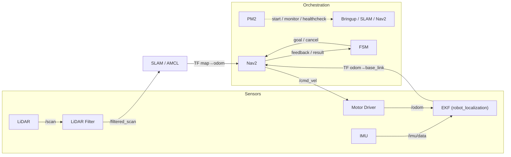

# Indoor Logistics Robot Stack (180° LiDAR & ROS2)

저비용 실내 물류로봇을 위해 **전방 180° 단일 LiDAR**와 **실내 맵 기반 자율주행**을 구현한 ROS2 스택입니다.  

**모터 드라이버 기반 구동부 제어**와 **센서 파이프라인**을 한 레이어에서 통합해, 상위 스택에 **일관된 토픽/TF**를 공급합니다.  

운영은 **Docker 컨테이너**와 **PM2 프로세스 감시**를 통해 현장 재시작, 헬스체크, 로그 수집을 자동화했습니다.

- **역할**: LiDAR **필터링** 및 Odom, IMU를 **융합**하여 안정적인 **맵 생성 → 로컬라이제이션 → 자율주행** 수행  
- **구성**: 하드웨어 브링업 레이어(z8015), 위치 추정(Localization, EKF), SLAM(Cartographer, SLAM Toolbox), 주행 스택(Nav2, Zeta_Navigation2), 상태 기계(FSM), 운영 자동화 & 프로세스 감시(Scripts, PM2), Docker 환경
- **활용**: 창고, 사무동, 학교 등 **실내 물류로봇**(저가형 하드웨어) 현장 투입 및 빠른 재현/확장

---

## 📌 1. 필요하게 된 상황

실내 환경에서 **RTK-GNSS 미사용**, **저가형 센서 구성**으로 자율주행을 안정화해야 합니다.

- LiDAR **1대(전방 180°)** → **후방 사각**·근접/차체 **반사 노이즈**로 스캔 매칭 불안정
- 부팅/교체 시 **USB 디바이스 경로 변동**과 **센서 준비 지연** → 초기 기동 **레이스 컨디션**
- **GNSS 부재**로 **실내 맵 기반 로컬라이제이션**만 의존 → 초기 포즈 오류/드리프트 시 복구 난이도 상승
- 후방 시야 부재로 **후진·급회전 안전 리스크** 및 현장 장애 발생 시 **신속 복구 체계 필요**

👉 본 스택은 **아키텍처 설계**와 **필터링**, 그리고 **오케스트레이션**을 통해 위 제약을 체계적으로 보완하여 현장 신뢰성을 확보합니다.

---

## 🔧 2. 시스템 구성

로봇단은 다음 요소로 동작합니다.

- **하드웨어 브링업 레이어 (`z8015`)**
  - **모터 드라이버** (`ZLAC8015D`) → `cmd_vel` 변환, 속도/가속 한계 적용, 통신 예외 재시도
  - **IMU** (`wt901`) → `sensor_msgs/Imu` 발행, EKF에 yaw 안정성 제공
  - **LiDAR** (`rplidar s3`) → `/scan` 발행, 맵 생성, 스캔 매칭, 장애물 갱신의 핵심 관측 입력을 제공
  - **LiDAR 필터** (`lidar_filter`) → 각도 구간별 min/max range로 필터링으로 노이즈 제거 → **`/filtered_scan`** 표준화
  - **조이스틱/수동 모드** → 초기 테스트, 도킹, 트러블 슈팅 시 수동 제어 제공
  - **브링업 런치** (`z8015_mobile_bringup`) → `ekf`, `TF`, `twist_mux` 포함하여 상위 스택에 일관된 토픽/TF 공급

- **위치 추정 (`robot_localization`, `ekf`)**  
  - Odom + IMU 융합으로 `map → odom → base_link` TF 체인 안정화

- **SLAM (`Cartographer` / `SLAM Toolbox`)**  
  - 실내 맵 생성(맵핑 모드) 및 loop-closure, Localization 모드에서 **AMCL**로 위치 추정

- **주행 스택 (`nav2`, `zeta_navigation2`)**  
  - Planner/Controller/Recovery/BT 플러그인 기반 운영 최적화

- **상태 기계 (`fsm_waypoint`)**  
  - Bringup/경로/재경로/장애/리커버리를 제어하는 **상태 기계**로 주행 사이클 제어 및 텔레메트리 발행

- **운영 자동화 & 프로세스 감시 (`scripts/*`, `pm2`)**  
  - USB 고정 symlink(udev), **헬스체크 기반 순차 실행(fail-fast)**, **프로세스 감시 및 자동 재시작**, 로그 롤링

- **Docker 환경**  
  - 전체 시스템을 컨테이너로 패키징하여 손쉽게 실행 및 배포 가능

- **Safety 레이어**  
  **(적용)** `twist_mux` **긴급 채널/락** 구조( `emergency/cmd_vel`, `pause_navigation` 등 )  
  **(적용 예정)** 초음파/IR/범퍼 → `/safety/stop` → **lock(E-Stop)** 연동, 180° FOV 보완(후진 제한/감속, 회전 후 전진)

---

## 🔀 3. 시스템 아키텍처 & 데이터 흐름

