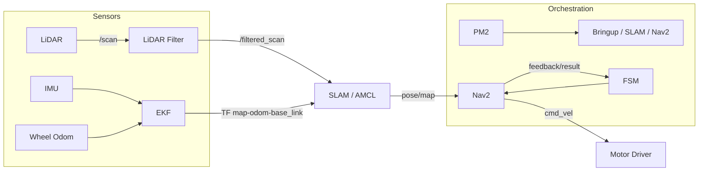

# z8015odroid — Indoor Logistics Robot Stack (180° LiDAR & ROS 2)

저비용 실내 물류로봇을 위해 **전방 180° 단일 LiDAR**와 **실내 맵 기반 자율주행**을 구현한 ROS 2 스택입니다. 센서 세팅·동기화부터 SLAM/Localization/Nav2/FSM, Docker/PM2 운영까지 실전 운용 흐름을 그대로 담았습니다.

- **역할**: 180° FOV LiDAR, IMU, Wheel Odom을 **필터링·융합**하여 안정적인 **맵 생성/로컬라이제이션/자율주행** 수행  
- **구성**: `z8015`(모터 드라이버·센서·브링업), Cartographer/SLAM Toolbox, AMCL, robot_localization(EKF), Nav2(zeta_navigation2), FSM Waypoint, udev rules, Docker/PM2  
- **활용**: 창고/사무동/학교 등 **실내 물류로봇**(저가형 하드웨어) 현장 투입 및 빠른 재현/확장

---

## 📌 1. 필요하게 된 상황

실내 환경에서는 GNSS를 사용할 수 없고, 저가형 모델일수록 센서 구성이 제한됩니다.

- LiDAR **1대 / 전방 180°** → 후방 미인지, 근접·차체 반사 노이즈  
- 하드웨어 교체/부팅 시 **USB 경로 변동**, 센서 준비 타이밍 이슈  
- **실내 맵 기반**으로 안정적인 로컬라이제이션/경로추종 유지 필요

👉 본 스택은 위 제약을 **소프트웨어 아키텍처·필터링·오케스트레이션**으로 보완해 **현장 신뢰성**을 확보하는 데 초점을 맞췄습니다.

---

## 🔧 2. 시스템 구성

로봇단은 다음 요소로 동작합니다.

- **z8015 — Device & Bringup Layer (`z8015/src/*`)**
  - **모터 드라이버** (예: ZLAC8015D, RS-485) → `cmd_vel` 변환, 속도/가속 한계 적용, 통신 예외 재시도
  - **IMU** (Witmotion 계열) → `sensor_msgs/Imu` 발행, EKF에 yaw 안정성 제공
  - **LiDAR 필터** (`lidar_filter`) → 각도 구간별 min/max range로 근접 반사·차체 간섭 제거 → **`/filtered_scan`** 표준화
  - **조이스틱/수동 모드** → 초기 셋업·비상 운용 경로 제공
  - **udev rules** → `/dev/driver`, `/dev/rplidar`, `/dev/mwahrs` 고정 symlink
  - **브링업 런치** (`z8015_mobile_bringup`) → EKF/TF/`twist_mux` 포함하여 상위 스택에 일관된 토픽·TF 공급

- **State Estimation (robot_localization)**  
  Odom + IMU 융합으로 `map → odom → base_link` TF 체인 안정화

- **SLAM (Cartographer / SLAM Toolbox)**  
  실내 맵 생성(맵핑 모드) 및 loop-closure  
  Localization 모드에서 **AMCL**로 빠르고 견고한 위치 추정

- **Navigation (Nav2 + zeta_navigation2)**  
  Planner/Controller/Recovery/BT 커스텀  
  컨테이너 기동 전 **토픽 헬스체크**(미준비 시 빠른 실패)로 운영 안전성 확보

- **FSM Waypoint (nav2/fsm_waypoint)**  
  Bringup/경로/재경로/장애/리커버리 **상태 기계**  
  주행 사이클 제어 및 텔레메트리 발행

- **운영 스크립트 (`scripts/*`) & PM2**  
  USB 고정 symlink(udev)와 **프로세스 감시/자동 재시작**, **토픽 레이트 기반 헬스체크**

- **(권장) Safety 레이어**  
  초음파/IR → `twist_mux` **lock** 연계(E-Stop)  
  180° 보완을 위해 **후진 제한/감속** 및 **회전 후 전진** 패턴

---

## 🔀 3. 시스템 아키텍처 & 데이터 흐름

